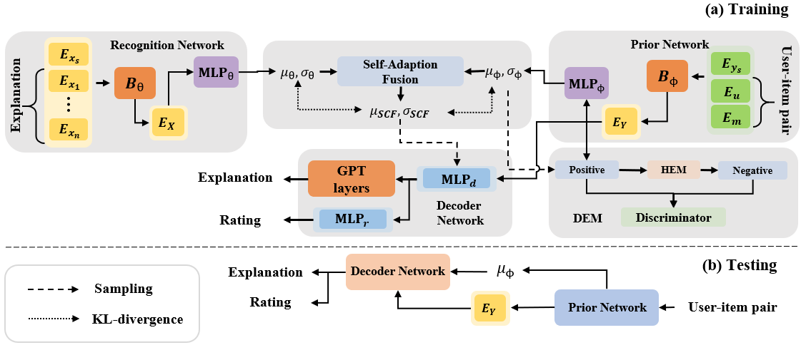

# [PEVAE: A Hierarchical VAE for Personalized Explainable Recommendation](https://dl.acm.org/doi/abs/10.1145/3477495.3532039)
## Download Origin Data
**Yelp** ```https://www.yelp.com/dataset```

**Amazon-Book** and **Amazon-Movie** ```https://nijianmo.github.io/amazon/index.html```

You have to fill out a form before downloading the data.
## Process Data
The following tool is used to extract explanations from reviews.

```https://github.com/lileipisces/Sentires-Guide```

Detailed steps to reproduce the data have been described in our paper and you can use ```models/dataset/data_filter.py``` to filter out data.

## Data Samples

>YELP

|User|Item|Rating|Explanation|
| ----------- | ----------- | ----------- | ----------- |
|'c-Nuhw2acbo7rGuZMCEvEA'|'buF9druCkbuXLX526sGELQ'|5|"It's about enjoying amazing food and wine"|
| '1kM4jg4O-tFrmuBBnb8wdA'| 'buF9druCkbuXLX526sGELQ'| 1|'The Service is horrible the waitress never comes over to the table'|
| 'avQ84oaYIM0YTh2FkfSFzQ' | 'buF9druCkbuXLX526sGELQ' | 5|"The price's on the menu are very affordable compared to other restaurants in the area"|
| '1wjAOyoBauz_al_SLqITrQ' | 'buF9druCkbuXLX526sGELQ' | 5|'the prices are very fair for the superb quality'|
| 'wvnwou32Tww-xf27yvFn2Q' | 'buF9druCkbuXLX526sGELQ' | 2|'The fried bread with the burrata was excellent'|

>Amazon-Movie

|User|Item|Rating|Explanation|
| --- | --- | --- | --- |
| 'A1VKW06X1O2X7V' | '0005019281' | 5 |"It's an enjoyable twist on the classic story"|
| 'A3R27T4HADWFFJ' | '0005019281' | 4|'The casting is excellent and the music and theme old but very relevant'|
| 'A13KAQO9F5X0FN' | '0005019281' | 4|'a little twist from the ordinary scrooge movie'|
| 'AZBWH4HLG3JWV' | '0005019281' | 5|'The acting is splendid and the story is well written'|
| 'A2Q8O413HJZ55E' | '0005019281' | 2|'It was too contrived and predictable.'|

## Requirements

```
pip install -r requirements.txt
```

## Reproduce Guides
Experiment results will be recorded automaticly by tensorboard. Run tensorboard with 
```tensorboard --logdir ./runs```

To reproduce our results run commands:

>YELP
```
python main_re.py --data adr --data_dir data/writePrompts --model DLS_VAE --log_dir ./logs --use_mutual False --beta 0.3  --use_attention False --init_lr 1e-4 --anneal_x0 10000  --gpu_idx 2 --target_kl 25 --improve_threshold 0.97 --batch_size 256 --warmup_steps 2000 --dropout 0.3 --ckpt_step 2000 --tau 0.5 --grad_clip 5.0 --dec_cell_size 512 --embed_size 100   --do_follow --direct_follow --data_path ./feature/yelp --teach_force_bound 50 --exp_name yelp --optim_times 5 --do_pred
 ```
>Amazon-Movie
```
python main_re.py --data adr --data_dir data/writePrompts --model DLS_VAE --log_dir ./logs --use_mutual False --beta 0.3 --use_attention False --init_lr 1e-4 --anneal_x0 10000  --gpu_idx 2 --target_kl 25 --improve_threshold 0.97 --batch_size 256 --warmup_steps 2000 --dropout 0.3 --ckpt_step 2000 --tau 0.5 --grad_clip 5.0 --dec_cell_size 512 --embed_size 100   --do_follow --direct_follow --data_path ./feature/amazon_movie --teach_force_bound 50 --exp_name amazon_movie --do_pred 
 ```
>Amazon-Book
```
python main_re.py --data adr --data_dir data/writePrompts --model DLS_VAE --log_dir ./logs --use_mutual False --beta 0.3 --use_attention False --init_lr 1e-4 --anneal_x0 10000  --gpu_idx 2 --target_kl 25 --improve_threshold 0.97 --batch_size 256 --warmup_steps 2000 --dropout 0.3 --ckpt_step 2000 --tau 0.5 --grad_clip 5.0 --dec_cell_size 512 --embed_size 100   --do_follow --direct_follow --data_path ./feature/amazon_book --teach_force_bound 50 --exp_name amazon_book --do_pred
```




The main implements are contained in `DIS_VAE`. We are improving the code and documentations, as well as adding instructions to download pre-trained checkpoints. Please stay tuned!
```
@inproceedings{10.1145/3477495.3532039,
author = {Cai, Zefeng and Cai, Zerui},
title = {PEVAE: A Hierarchical VAE for Personalized Explainable Recommendation.},
year = {2022},
isbn = {9781450387323},
publisher = {Association for Computing Machinery},
address = {New York, NY, USA},
url = {https://doi.org/10.1145/3477495.3532039},
doi = {10.1145/3477495.3532039},
abstract = {Variational autoencoders (VAEs) have been widely applied in recommendations. One reason is that their amortized inferences are beneficial for overcoming the data sparsity. However, in explainable recommendation that generates natural language explanations, they are still rarely explored. Thus, we aim to extend VAE to explainable recommendation. In this task, we find that VAE can generate acceptable explanations for users with few relevant training samples, however, it tends to generate less personalized explanations for users with relatively sufficient samples than autoencoders (AEs). We conjecture that information shared by different users in VAE disturbs the information for a specific user. To deal with this problem, we present PErsonalized VAE (PEVAE) that generates personalized natural language explanations for explainable recommendation. Moreover, we propose two novel mechanisms to aid our model in generating more personalized explanations, including 1) Self-Adaption Fusion (SAF) manipulates the latent space in a self-adaption manner for controlling the influence of shared information. In this way, our model can enjoy the advantage of overcoming the sparsity of data while generating more personalized explanations for a user with relatively sufficient training samples. 2) DEpendence Maximization (DEM) strengthens dependence between recommendations and explanations by maximizing the mutual information. It makes the explanation more specific to the input user-item pair and thus improves the personalization of the generated explanations. Extensive experiments show PEVAE can generate more personalized explanations and further analyses demonstrate the practical effect of our proposed methods.},
booktitle = {Proceedings of the 45th International ACM SIGIR Conference on Research and Development in Information Retrieval},
pages = {692–702},
numpages = {11},
keywords = {variational inference, natural language generation, recommender systems},
location = {Madrid, Spain},
series = {SIGIR '22}
}
```
